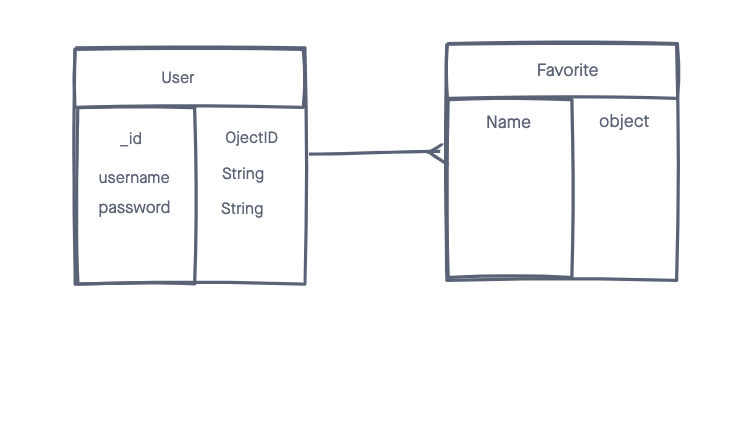

# Pokemon React App

A simple Pokemon database

## Techonologies Used

-HTML5
-CSS3
-JavaScript
-Bootstrap
-MongoDB
-Express
-NodeJs
-React
-Pokemon Api
-Bcrypt
-Cors
-Dotenv
-Jsonwebtoken
-Mongoose
-Morgan

## Screenshots

## Getting Started

[Click Here](https://pokemon-project-3-front.herokuapp.com/) to see the deployed app!

[Click Here](https://trello.com/b/A200ltUy/project-3) Trello Board!

## Future Enchancments
- Add favorite pokemon 
- Add pokemon images
- Add more pokemon info
